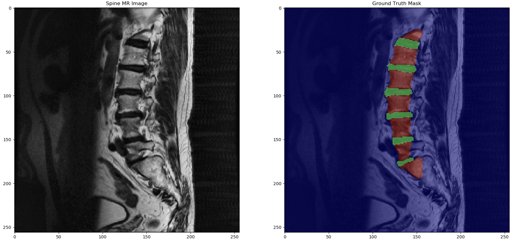
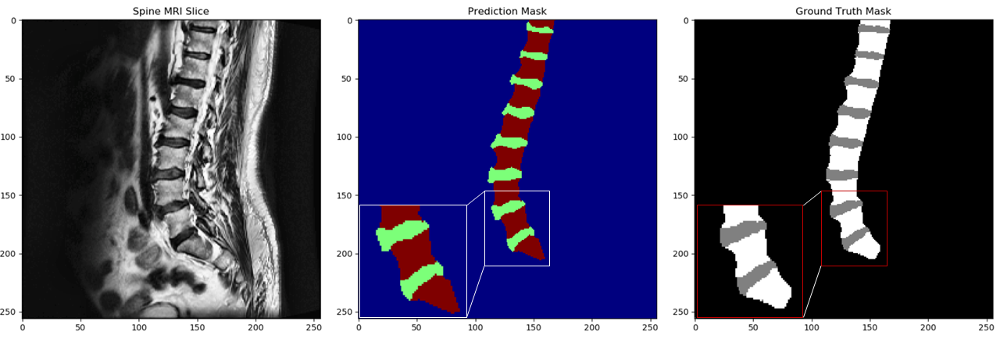

# Vertebrae and Spine Segmentation
PyTorch code: Spine and Vertebrae Segmentation 

**Dataset:** The “images” folder contains 20 pngs of spine MRI slices. The “masks” folder contains 20 .npy files, where each mask represents the segmentation map of the discs and vertebrae for the corresponding spine image (1.png goes with 1.npy, etc.). 

* Label 1: disc location
* Label 2: Vertebrae
* Label 0: Background

## What we’re looking for:
- [x] A data loader capable of reading in the provided dataset in batches
- [x] A script or instructions demonstrating using the data loader to run through 1 epoch of model training with a segmentation network
- [x] Well-organized, easily-understandable, and documented code
- [x] Object oriented programming where appropriate

### Additionally, please answer the following questions about your code:
* What, if anything, did you do to verify that the segmentation masks and images were correctly aligned in the data loader?

* What assumptions did you make about the data or model training during this process?
  * Very straight forward, this is exactly as our daily task in the lab. This task is quite simple, and I have already built-in scripts for differet tasks to handle medical data including, data augmentation, noramlisation, preprocessing and overall training structur.

## Model output

## How to train
To train the model, please run the following command, you can change the parameters within the train.py file.

_Emphasized text_

    Markup :  _Emphasized text_ or *Emphasized text*
